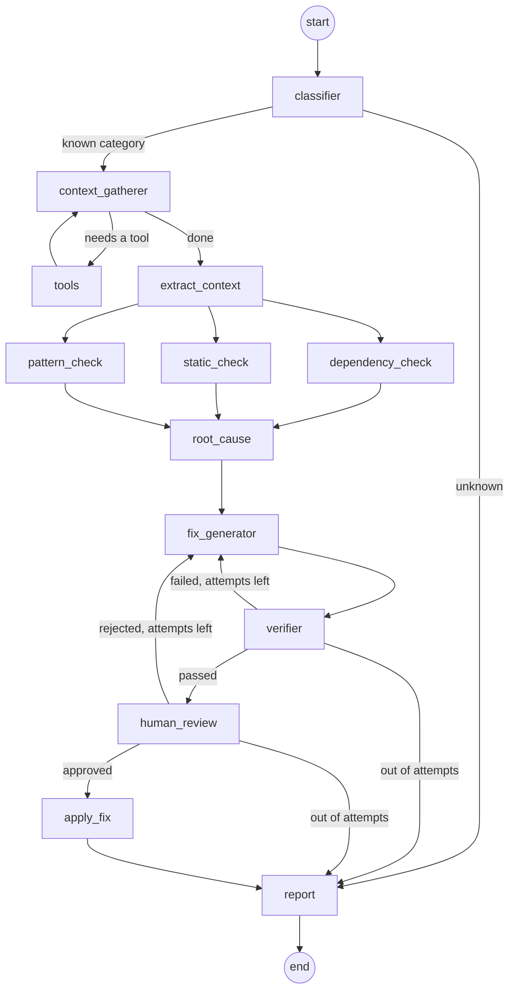

# AI Software Debugger (LangGraph)
 
An autonomous root-cause analysis and fix agent, built with LangGraph. Point it at a local Python repository and an error, and it investigates the codebase, diagnoses the root cause from multiple angles in parallel, generates a fix, verifies the fix by actually running it, and — only after a human approves — applies it to disk.
 
This was built as a practice project to get hands-on with LangGraph's core orchestration patterns, using a real, useful task instead of a toy example.
 
## What it does
 
1. You give it a repository folder and either paste an error or let it run a file and capture the error itself.
2. It classifies the error, gathers the relevant code by exploring the repo with tools (not by being told which file to look at), runs three independent diagnostic checks in parallel, and combines them into one root cause.
3. It generates a fix, actually runs the fixed code to verify it works, and retries with feedback from the failure if it doesn't.
4. It pauses and shows you the proposed fix. Nothing is written to disk until you approve it.
5. Once approved, it writes the fix, re-confirms it runs cleanly, and produces a final report.
## Architecture
 

 
## LangGraph patterns demonstrated
 
| Pattern | Where |
|---|---|
| **Conditional routing** | `classifier` routes to either the full investigation or straight to the report, depending on the error category |
| **Tool-calling loop** | `context_gatherer` ⇄ `tools` — the LLM decides which files to list, read, or search, one round at a time |
| **Parallel execution + custom reducer** | `dependency_check`, `static_check`, and `pattern_check` run simultaneously and merge into one `diagnostics` dict via a custom reducer, avoiding `InvalidUpdateError` |
| **Iterative revise loop** | `fix_generator` ⇄ `verifier` — a fix is generated, actually executed, and retried with the failure reason fed back in, up to a capped number of attempts |
| **Human-in-the-loop** | `human_review` uses `interrupt()` to pause the graph and wait for a real approve/reject decision before anything is written to disk |
| **Sequential pipeline** | `apply_fix` → `report` — the approved fix is written, re-verified for real, and summarized, one stage after another |
 
## Project structure
 
```
src/
  state.py           # shared State schema for the whole graph
  reducers.py         # custom reducer for the parallel diagnostics
  llm.py               # single LLM factory (Groq or Gemini via .env)
  tools.py             # list_files, read_file, search_in_repo
  utils.py             # shared helpers (run_python_file, files_as_text)
  graph.py             # builds and compiles the graph
  main.py              # CLI entry point
  nodes/
    classifier.py
    context_gatherer.py
    diagnostics.py       # dependency_check, static_check, pattern_check
    root_cause.py
    fix_generator.py
    verifier.py
    human_review.py
    apply_fix.py
    report.py
sample_broken_repo/         # test fixtures with real, reproducible bugs
sample_broken_repo_backup/  # untouched copies, since the agent fixes files in place
```
 
## Running it
 
Requires Python and [uv](https://docs.astral.sh/uv/).
 
```bash
uv sync
```
 
Add your API key to `.env`:
```
LLM_PROVIDER=groq
GROQ_API_KEY=your_key_here
```
(Set `LLM_PROVIDER=gemini` and add `GOOGLE_API_KEY` instead to use Gemini — the two are interchangeable, since every node goes through a single `get_llm()` factory.)
 
```bash
uv run src/main.py
```
 
You'll be asked for a repository path and how to provide the error — either point it at a file to run, or paste an error message yourself.
 
### Sample fixtures
 
`sample_broken_repo/` contains three small, deliberately broken files to test against:
 
- **`broken_imports.py`** — a `ModuleNotFoundError` from an import that doesn't exist.
- **`buggy_math.py`** — a logic bug (off-by-one in a loop), surfaced by a failing `assert` rather than a crash.
- **`broken_graph.py`** — a LangGraph-specific bug: two nodes writing to the same unreduced state key, raising `InvalidUpdateError`.
Since the agent applies approved fixes directly to disk, restore a fixture from `sample_broken_repo_backup/` before re-testing it.
 
## Example run
 
Running against `broken_graph.py` turned up something worth calling out. The fixture actually had two separate bugs stacked on top of each other — a bad edge reference (`ValueError: Found edge ending at unknown node ...`) sitting in front of the intended `InvalidUpdateError`. Static analysis alone only saw the first one, since the file couldn't even compile far enough to reach the second.
 
- **Attempt 1**: the agent fixed the edge-reference bug based on the diagnosis. The verifier then actually *ran* the fixed file — and hit the second, previously invisible `InvalidUpdateError`.
- **Attempt 2**: fed that real failure, the agent recognized it as a different problem and fixed it too, by splitting the shared state key into two separate keys rather than adding a reducer — a valid alternative solution.
This is the payoff of verifying fixes by execution instead of trusting the diagnosis alone: it caught a bug that static analysis missed, without any extra guidance.
 
```
Error category: langgraph
Files investigated: ['sample_broken_repo/broken_graph.py']
 
Root cause:
The root cause is that `graph.add_edge` is given the function object `node_b` as the
target instead of the node's registered name, so during compilation the validator
cannot find a node with that identifier and raises `ValueError: Found edge ending
at unknown node <function node_b ...>`. Fix it by passing the correct node key
(the string name of the node that was added to the graph) as the edge's target.
 
Fix attempts: 2
Human approved: True
Verified working: True
Fix was applied to: sample_broken_repo/broken_graph.py
```
 
## Known limitations
 
- **Fixes are executed on the host machine**, via `subprocess`, not in a sandbox. Fine for practice fixtures; a production version would run verification inside Docker or a similar isolated environment.
- **`dependency_check` checks the debugger's own environment**, not the target repository's virtual environment, so it can report a false "missing module" if the two environments differ.
- **One file at a time.** The agent fixes a single file per run; it doesn't yet handle a bug whose fix spans multiple files.
- **Repo scanning is a simple recursive walk** over `.py` files, skipping `venv`/`__pycache__`, with plain-text search rather than a real code index.
## Possible improvements
 
- Sandboxed (Docker) verification instead of local `subprocess`
- Multi-file fix support
- Support for languages beyond Python
- A lightweight web UI instead of a terminal CLI for the approval step
## Built with
 
LangGraph, LangChain, Groq / Google Gemini, Python
 